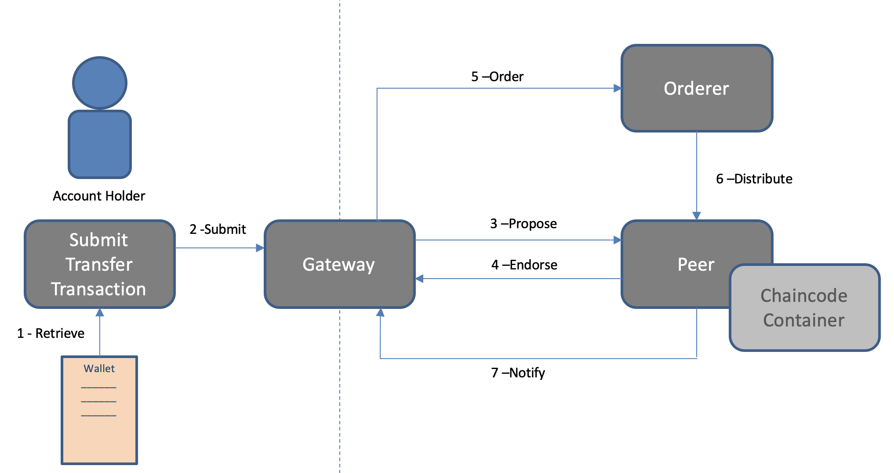

## Use case

We decided to create a voting-system whcich can be used for businesses.

In this application you can annonymously register a voter and vote for a specific election which has been created by an electionCreator which would be the admin of the election.

## How are particpants, assets and transactions modelled

### participants

The participants are catagorized into 3 groups. Voters, electionCreators and Participants.

#### Voter
Voters represent the person who votes on a specific election that has been created by an electionCreator.

Voters are registered by the user himself and is only able to select a participant and cast their vote.

The identity of the voter is completely anonymous and encrypted.

#### electionCreator
The electionCreator is responsible for creating the election and managing the election by creating, starting and ending the election.

An electionCreator can perform the following transactions:

creating a participant.
creating an election.
starting an election.
finishing an election which also counts the votes.
An election creator can also retrieve all data about a specific election or participant. But not from the voter itself.

#### participants
The participants are created by the electionCreator and are persons who the voter is able to vote on.

the participant does not have any transactions it can perform because it is purely used to give as a voting option.


## assets
The assets in this application are the election itself and the participants aswell. The election model has a few different componenents.

the election has an id, name, the current status and a list of participants who the voter is able to vote on.

the participants have an id, name, a voteCount and a boolean flag indicating whether the participant has already voted or not.


## business rules

Eligibility verification: Participants must meet specific criteria to be eligible to vote. Since this application is used in businesses and not as an national election the election creator is able to give out links to persons who are eligible to vote.

Vote validation: Each vote must be validated to ensure it adheres to the defined rules, such as not voting multiple times, casting valid choices. This is being done by a boolean in the participant model setting it to true when the voter has voted.

Result calculation: The system must accurately calculate and aggregate the voting results based on the votes cast by voters. This is being done when a voter casts a vote the participants voteCount gets updated.

## event consumers

Participants: Participants in the voting system may consume events related to their own actions, such as receiving notifications when their vote is successfully cast or being updated on the election results.

Election creator: Election administrators responsible for managing the voting process may consume events to monitor the progress of the election, detect any irregularities, and ensure the integrity of the system.

## Peers, organisations and endorsement

In this application there are 2 peers and 2 organisations.

The 2 peers which endorse with each othe to make sure that the election and the transactions around the election are synchronized.

### Transaction Endorsement

The consensus in Hyperledger Fabric is reached through endorsement. Every chaincode has an endorsement policy which specifies the set of peers on a channel that must execute chaincode and endorse the execution results for the transaction to be considered valid. These endorsement policies define the organizations (through their peers) who must “endorse” (i.e., approve of) the execution of a proposal [1].

As part of the transaction validation step performed by the peers, each validating peer checks to make sure that the transaction contains the appropriate number of endorsements and that they are from the expected sources (both of these are specified in the endorsement policy). The endorsements are also checked to make sure they’re valid (i.e., that they are valid signatures from valid certificates) [1].

An endorsement policy is a condition on what endorses a transaction. Blockchain peers have a pre-specified set of endorsement policies, which are referenced by a deploy transaction that installs specific chaincode. Endorsement policies can be parametrized, and these parameters can be specified by a deploy transaction.


The figure below presents the standard workflow of chaincode transaction execution and endorsement.




### starting the application

## You will see a folder structure with three elements:

* **chaincode**: The business logic of the blockchain network
* **client/backend**: A backend application that allows users to interact with the blockchain network through a REST interface
* **client/app**: An Angular application that interacts with the backend
* **doc**: Some documentation elements

## Startup commands

In this step, you will start your blockchain network. You should follow these instructions:

1. Open a terminal screen

3. Go to `fabric-samples/test-network` folder, normally installed in the home folder of your file system

5. Execute the following command to create and start the blockchain network: 

```
./network.sh up createChannel -ca -s couchdb 
```

Where, the *up* command will start the network by using docker containers, the *createChannel* command will create the default channel *myChannel*, the *-ca* option will create certificate authorities for organisations 1 and 2, and the *-s couchdb* option enables the CouchDB database per peer. 

Note: At any time, you can stop the network by running `./network.sh down`. At the time of writing this tutorial, the Docker desktop version is 3.3.0. If the script is taking to long to finish, try to restart Docker.

The figure below illustrates the consortium components:


## Deploying the chaincode

A [chaincode](https://hyperledger-fabric.readthedocs.io/en/latest/developapps/contractname.html#chaincode) is a generic container for deploying code to a Hyperledger Fabric blockchain network. One or more related smart contracts are defined within a chaincode. Every smart contract has a name that uniquely identifies it within a chaincode. Applications access a particular smart contract within a chaincode using its contract name.

After you have used the network.sh startup command, you can deploy the chaincode on the channel using the following commands:

1. Go to fabric-samples/test-network
2. Execute the command:

```
./network.sh deployCC -ccn egg-tracking -ccp [base-folder]/voting-system/chaincode -ccv 1 -ccs 1 -ccl javascript
./network.sh deployCC -ccn egg-tracking -ccp /Users/germain/projects/BLOCKCHAIN/ARCHITECTURE/voting-system/chaincode -ccv 1 -ccs 1 -ccl javascript 
```

Where [base-folder] is the location where you cloned this project, egg-tracking is the name of the chaincode, the parameter -ccl javascript is the language used to write the chaincode. This example was built with javascript. The parameter -ccv 1 and -ccs 1 refers to the version and sequence. If you change something in your chaincode and wants to redeploy, you should increment these values.

## Client Interaction

In a typical business blockchain application, network participants invoke smart contracts by using a client. The client, in turn, is responsible for submitting the transaction to peers and return the response to the client. 

This example has a client that exposes a RESTful API to interact with a blockchain network. This approach is useful if you have a variety of clients like web applications, mobile applications, and IoT devices, for example. 

Now we are examining how to interact with the network.

### Installing client dependencies 

First, you should install the dependencies.

Using the terminal window, execute the following command in the **client/backend** folder:

```
npm --logevel=error install
```

This command will install all dependencies in the *node_modules* folder.

### Setting up HLF network configuration

Our client programs are using the test-network connection profile to connect to the network. All programs are using the FABRIC_PATH variable. Thus, by using your terminal, you should create the variable FABRIC_PATH pointing to the folder of your fabric-samples, for example:

```
export FABRIC_PATH=~/fabric-samples
export FABRIC_PATH=~/go/src/github.com/germaintje/fabric-samples
```

### Adding the first user to the wallet

A [wallet](https://hyperledger-fabric.readthedocs.io/en/latest/developapps/wallet.html) contains a set of user identities. An application run by a user selects one of these identities when it connects to a channel. An application run by a user selects one of the available identities when it connects to a channel.

The administrator of an organisation can issue certificates to new users. You will need that to create the participants of the egg tracking network such as farmers, distributors and shippers. Thus, you should export the admin certificate to the **client/backend/wallet** folder. To do so, execute the following operation:

```
node src/enrollAdmin.js
```

This command logs in to the certificate authority of organisation 1 and download the certificate of the administrator of org1, and add it to the *wallet* folder. 

Note: If you run this command again, you should manually remove the previous certificate file of the admin user(*admin.id*). Otherwise, the system will generate an error message telling that the certificate already exists.

Now you are ready to run the application.

### Running the client

You can start the API by executing the following command in the *client/backend* folder:

```
npm start
```

This command will start an HTTP server running on port 8080.

### Starting the frontend server

use the following command

```
cd client/app
```

to start up the frontend server type the following command:

```
npm run dev
```

This starts a local development server in which the application can be used.


## Using the application

Once the frontend and backend server are running. You are able to create a Voter in the register screen.

Once you have registered an account it automatically creates a electionCreator and you are able to create an election.

Since the frontend is just for show. The creating of an election is hardcoded.

Once you have created an election it automatically starts to create 3 test participants.

You can click on one of these participants and vote on one of them using the vote button.

After that you are able to click on the finish election button simulating that you are an election creator and finishing the election and counting the votes. It should be noted that ONLY electioncreators can actually create, start and finish an election. But for simplicity it is all put into one single page.


